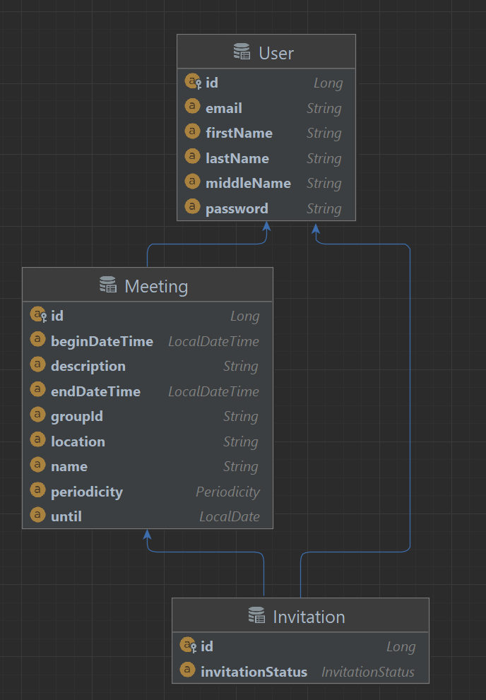

# Calendar RESTful API
RESTful API Календарь, имеющий следующую функциональность:
* создание и удаление пользователя
* изменение данных пользователя
* получение данных о пользователе
* создание и удаление встречи
* изменение встречи
* получение деталей встречи (название, время, место и тд)
* принятие или отмена приглашения на встречу от другого пользователя (если пользователь получил приглашение на встречу, но пока не принял или отменил её, то встреча получает статус “Под вопросом”)
* нахождение всех встреч пользователя для заданного промежутка времени
* повтор встреч (то есть встреча может быть не только одноразовой, но и проходить с некоторой периодичностью: ежедневно, раз в неделю, раз в месяц)
* отправление по почте уведомлений о приглашении на встречу. Приглашение также пеереотправляется в случае, если встреча была изменена.

### Структура данных:

### Стек технологий:
* Java 18
* Maven
* Spring Boot
  * Spring IoC 
  * Spring Web
* Spring Data Jpa, использующий Hibernate
* PostgreSQL
* OpenApi
* Lombok

Для создания публичного API был использован OpenApi.
Можно использовать готовый openapi-UI по адресу http://{хост}:{порт}/swagger-ui.html 